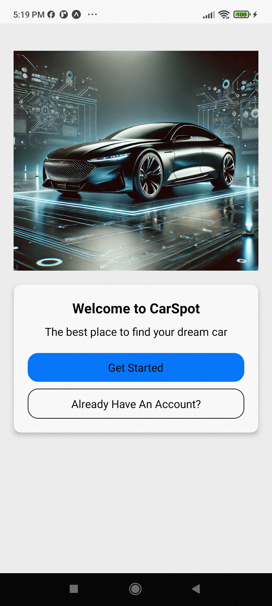
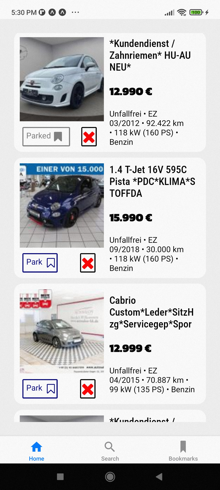
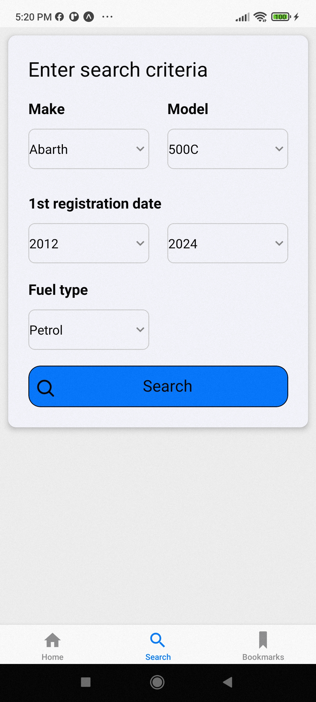
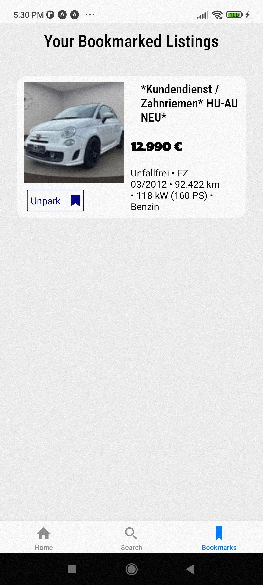
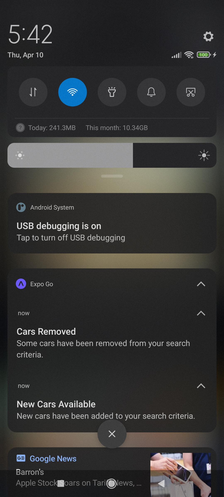
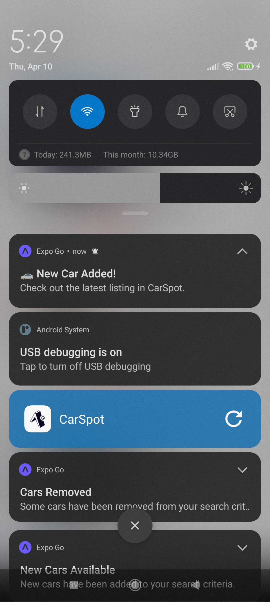

# 👋 Car Spot Mobile App

> Mobile app for tracking car sales listings. Includes react native app and web scrapper running on separate express server.

---
## 📋 Table of Contents

1. [About The Project](#about)
2. [Inspiration](#inspiration)
3. [Built With](#built)  
4. [Features](#features)  
5. [Left TO DO](#todo)  
6. [Screenshots](#screenshots)  
---

### 📖 About The Project

Short description:
- **Purpose:** To make process of browsing and tracking car listings on www.mobile.de marketplace easier.
- **Key features:** user friendly and responsive mobile app, web screpper built with puppeteer, local notifications, background process.

### 💡 Inspiration
-About a year ago i was asked by car deler who buys cars using mobile.de to build him mobile app that would help him track car listings and get notified about relevant changes. Back then i was not able to build it but i gave myself a challange to someday build it and that day has come!

-The idea is to enter search criteria for cars of your interest. Then application using web scraper (since mobile.de doesn't have API for that) takes data from their site and stores it in local SQLite database. It is also possible to remove specific listing from that list or to "Park" it which saves it to bookmarked and marks it as "specialy interesting".

### 🛠️ Built With

List of major frameworks, libraries, and tools:
- [React Native](https://reactnative.dev/) (for cross platform mobile apps)
- [Expo](https://expo.dev/) (platform for making universal native apps)
- [Axios](https://github.com/axios/axios) (for API calls)
- [SQLite](https://sqlite.org/) (Lightweight local database)
- [Expo GO](https://expo.dev/go) (easy way to test app on mobile device)
- [Drizzle ORM](https://orm.drizzle.team/) (easy way to communicate with SQL database using JavaScript or TypeScript)

### 📱 Features

- **Search Mechanism:** Enter search criteria that you want.
- **Car List:** Browse through a list of relevant listings.
- **Bookmarks:** Add or remove specialy interesting cars.
- **Notifications:** Get notified on any relevant changes related to saved listings.
- **Avaliability:** Available on android and ios.

### 📖 Left TO DO:
- **Visit listing:** Provide link to real listing.
- **Fix version problems:** Some version mismatch blocks production build.
- **Improve notifications and db connection problem**
- **Improve UI and UX:** There are few small things related to search and home page that could be frustrating to end users.

### 📷 Screenshots
- First Page
- 
- Home Page
- 
- Search Page
- 
- Bookmarks Page
- 
- Notifications
- 
- 
